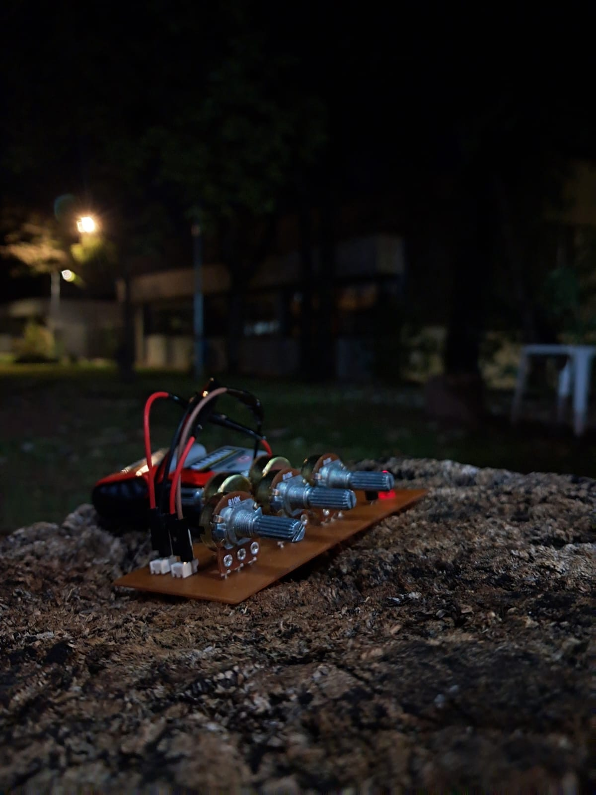
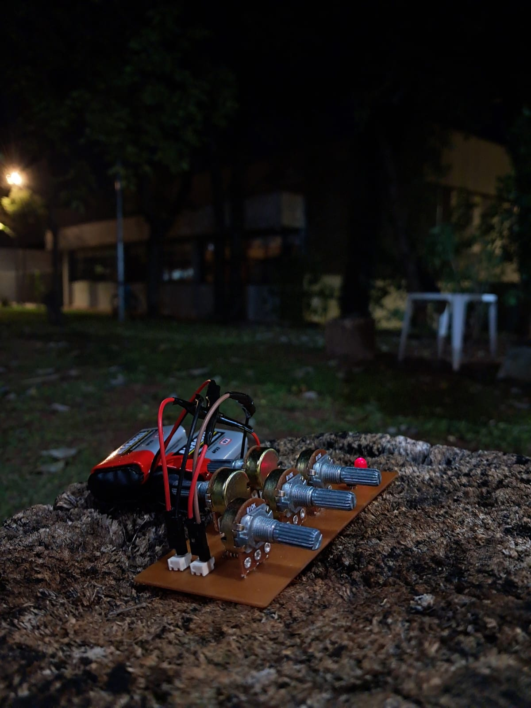
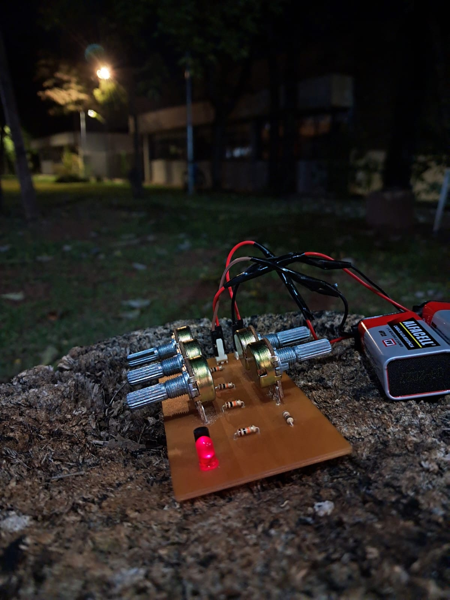
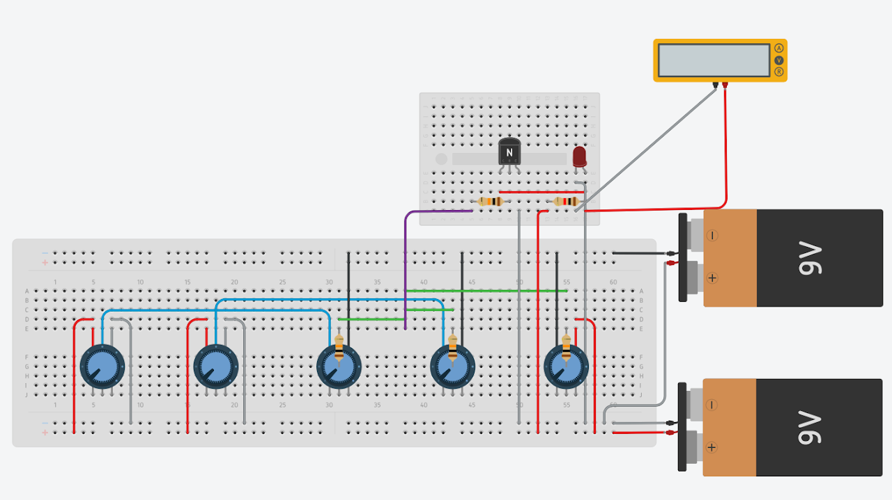
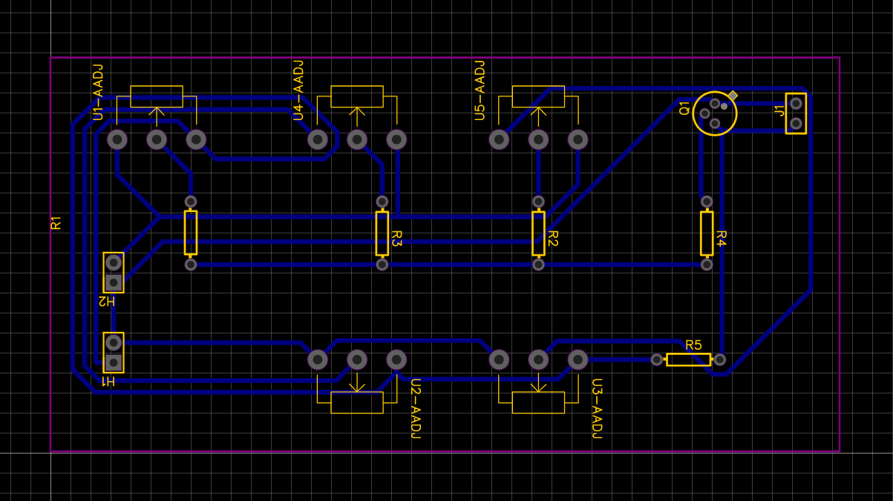

# Perceptron Analógico em Hardware

Implementação física de um Perceptron utilizando circuitos eletrônicos analógicos em placa de circuito impresso (PCB).

## Descrição do Projeto

Este repositório documenta o desenvolvimento de um Perceptron construído inteiramente em hardware analógico. O projeto foi desenvolvido como trabalho em grupo para as disciplinas de **Eletrônica para Computação** e **Evolução Histórica da Computação e Aplicações**, ministradas no Instituto de Ciências Matemáticas e de Computação (ICMC) da USP.

O dispositivo final está presente no acervo do **Museu da Computação da USP São Carlos**, servindo como peça de exposição e material didático.

## Funcionamento

O circuito implementa a lógica do Perceptron usando cinco potenciômetros, as duas entradas e seus respectivos pesos, além do bias. São utilizadas duas baterias de 9 V conectadas em série, gerando os potenciais +9 V, 0 V (GND) e -9 V. Os potenciômetros dos pesos e do bias trabalham com alimentação simétrica, enquanto as entradas operam na faixa de 0 V a +9 V.

O cursor do potenciômetro de cada entrada é ligado ao respectivo terminal superior de cada peso. Portanto, o cursor de cada potenciômetro de peso produzirá uma tensão proporcional ao produto entre a entrada e o peso. Por fim, essa tensão é aplicada ao nó de soma por meio de um resistor de 10 kΩ, que limita a corrente injetada por cada ramo, reduzindo a tendência de saturação imediata do transistor.

O bias, diferentemente dos outros potenciômetros, possui alimentação oposta, tensão negativa no terminal superior e positiva no terminal inferior, pois atuará como fator negativo no somatório do neurônio. 

O nó de soma é conectado à base do transistor 2N2222, que atua como aproximação da função de ativação. Quando a tensão base-emissor ultrapassa o limiar de aproximadamente 0,7 V, o transistor conduz, reproduzindo o comportamento de uma função degrau com limiar de ativação (um detalhe interessante é que, se usássemos um resistor na ligação do emissor do transistor ao GND, poderíamos aproximar uma sigmoide ou tanh).

## Componentes

### Componentes ativos

| Componente        | Quantidade | Preço   |
| ----------------- | ---------: | ------: |
| Transistor 2N2222 |          1 | R$ 2,55 |
| LED vermelho 5 mm |          1 | R$ 0,50 |
| **Subtotal**      |          — | **R$ 3,05** |

### Componentes passivos

| Componente                 | Quantidade | Preço    |
| -------------------------- | ---------: | -------: |
| Resistor 1 kΩ              |          1 | R$ 0,70  |
| Resistor 10 kΩ             |          4 | R$ 0,70  |
| Potenciômetro linear 10 kΩ |          5 | R$ 12,55 |
| **Subtotal**               |          — | **R$ 13,95** |

### Alimentação

| Componente            | Quantidade | Preço    |
| --------------------- | ---------: | -------: |
| Bateria 9 V           |          2 | R$ 13,12 |
| Clip para bateria 9 V |          2 | R$ 6,00  |
| **Subtotal**          |          — | **R$ 19,12** |

### Estrutura e interconexão

| Componente                          | Quantidade | Preço     |
| ----------------------------------- | ---------: | --------: |
| Placa de fenolite PCB (100 × 50 mm) |          1 | R$ 12,00  |
| Header 1×2                          |          2 | ≈ R$ 4,00 |
| **Subtotal**                        |          — | **R$ 16,00** |

---

**Custo total:** **R$ 52,12**

> Observação: Os preços indicados são referenciais e refletem os valores da época da compra dos componentes.

## Fotos do Hardware

Imagens do protótipo físico.

  
  
  

## Simulações

Antes da fabricação física, o circuito foi validado por meio de simulação eletrônica e projetado em ferramenta de design de PCB.

### Tinkercad (Simulação de Circuito)

Link da simulação: https://tinyurl.com/perceptron-usp

### EasyEDA (Projeto da PCB)

Link do projeto: https://tinyurl.com/perceptron-pcb

## Mais Informações

Detalhes adicionais sobre o projeto, incluindo a documentação das **técnicas utilizadas** e materiais complementares, estão disponíveis no site oficial:

[https://sites.google.com/usp.br/perceptron](https://sites.google.com/usp.br/perceptron)

## Autores

- **Eduardo Somensi Barbosa** — [GitHub](https://github.com/edusbarbosa)
- **Hermes dos Santos Fortes** — [GitHub](https://github.com/JuniorTWI)
- **José Gabriel Oliveira Gomes** — [GitHub](https://github.com/josegabriel-spec)
- **Ruan Vinicius dos Santos de Jesúz** — [GitHub](https://github.com/ruan-dejesuz)